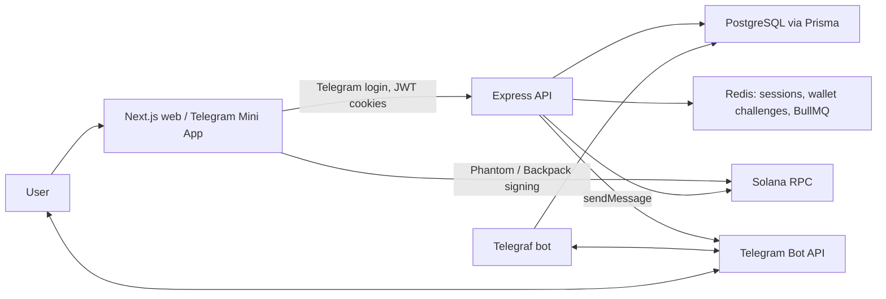

# SolSub

Кратко: это готовый монорепозиторий для Solana-подписок с Telegram Login Widget, Telegram Mini App auth, Next.js 14, Express, Prisma/PostgreSQL, Redis/BullMQ, Telegram bot и проверкой платежей по Solana transaction signature + memo nonce.

## Архитектура



Основные папки:

- `apps/api` - Express API, Prisma schema, Solana verifier, BullMQ jobs.
- `apps/web` - Next.js 14 App Router, Tailwind, wallet adapter, PWA manifest, Mini App auto-login.
- `apps/bot` - Telegraf bot commands: `/start`, `/status`, `/upgrade`, `/cancel`.
- `packages/shared` - тарифы и общие helpers.
- `docs/openapi.yaml` - OpenAPI 3.1 спецификация.

## Схема БД

Полная Prisma-схема находится в [apps/api/prisma/schema.prisma](./apps/api/prisma/schema.prisma). В ней есть `User`, `Wallet`, `SubscriptionPlan`, `Subscription`, `PaymentTransaction`, `NotificationLog`, enum’ы статусов, индексы, связи и каскадное удаление пользовательских данных.

Seed тарифов: Basic `0.1 SOL/month`, Advanced `0.5 SOL/month`, Premium `2 SOL/month`, плюс годовые цены. Запуск:

```bash
npm run prisma:deploy -w @solsub/api
npm run prisma:seed -w @solsub/api
```

## API

OpenAPI файл: [docs/openapi.yaml](./docs/openapi.yaml).

Ключевые endpoint’ы:

- `POST /api/auth/telegram` - принимает `loginData` от Telegram Login Widget или `initData` Mini App, проверяет hash и ставит `access_token`, `refresh_token`, `csrf_token`.
- `POST /api/wallet/challenge` и `POST /api/wallet/link` - привязка Phantom/Backpack через подпись одноразового challenge.
- `POST /api/subscription/initiate` - создает pending payment intent, nonce и Solana Pay link.
- `POST /api/subscription/confirm` - проверяет Solana signature, memo nonce, сумму и treasury destination.
- `GET /api/subscription/status` и `GET /api/subscription/payments` - личный кабинет.
- `GET /api/premium/wallet-analytics` - пример закрытого контента.
- `POST /api/webhooks/telegram` и `POST /api/webhooks/solana` - webhooks для Telegram Bot API и Helius.

## Безопасность

Реализовано:

- Telegram Login Widget hash validation: HMAC-SHA256 с secret `sha256(bot_token)`.
- Telegram Mini App `initData` validation: HMAC-SHA256 с secret `WebAppData`.
- JWT access + refresh в `httpOnly` cookies.
- Refresh-token allowlist/revocation в Redis.
- CSRF double-submit cookie: `csrf_token` должен совпасть с `x-csrf-token`.
- `SameSite=Strict`, `Secure` через env, `helmet`, CORS credentials и rate limiting.
- Wallet binding только после подписи challenge.
- Solana payment verification через `@solana/web3.js`: signature status, memo nonce, expected amount, treasury destination.
- Приватные ключи не хранятся в коде; treasury адреса и токены только через `.env`.

## Бэкенд-код

Важные файлы:

- [apps/api/src/server.ts](./apps/api/src/server.ts) - Express app, middleware, routes, graceful shutdown.
- [apps/api/src/security/telegram.ts](./apps/api/src/security/telegram.ts) - Telegram signature checks.
- [apps/api/src/security/wallet.ts](./apps/api/src/security/wallet.ts) - wallet challenge and signature verification.
- [apps/api/src/services/solana.service.ts](./apps/api/src/services/solana.service.ts) - Solana Pay URL and transaction verification.
- [apps/api/src/services/subscription.service.ts](./apps/api/src/services/subscription.service.ts) - payment intent and activation.
- [apps/api/src/jobs/subscription.jobs.ts](./apps/api/src/jobs/subscription.jobs.ts) - renewal reminders, expiration, payment intent cleanup.

## Фронтенд-код

Важные файлы:

- [apps/web/app/dashboard/page.tsx](./apps/web/app/dashboard/page.tsx) - основной личный кабинет.
- [apps/web/components/TelegramLoginButton.tsx](./apps/web/components/TelegramLoginButton.tsx) - Telegram Login Widget.
- [apps/web/components/MiniAppAutoLogin.tsx](./apps/web/components/MiniAppAutoLogin.tsx) - Mini App `initData` auto-login.
- [apps/web/components/WalletLinker.tsx](./apps/web/components/WalletLinker.tsx) - Phantom/Backpack link flow.
- [apps/web/components/PlanSelector.tsx](./apps/web/components/PlanSelector.tsx) - тарифы, Solana Pay link, SOL transfer + memo.
- [apps/web/app/dashboard/premium/page.tsx](./apps/web/app/dashboard/premium/page.tsx) - закрытый premium content.

## Telegram-бот

Файл: [apps/bot/src/index.ts](./apps/bot/src/index.ts).

Бот запускается как отдельный процесс на Telegraf, открывает Mini App и управляет подпиской командами:

- `/start` - ссылка на web app.
- `/status` - текущий тариф и дата окончания.
- `/upgrade` - открыть выбор тарифов.
- `/cancel` - отменить активную подписку.

Для webhook-режима можно использовать API endpoint:

```bash
curl "https://api.telegram.org/bot$TELEGRAM_BOT_TOKEN/setWebhook" \
  -d "url=https://YOUR_NGROK_DOMAIN/api/webhooks/telegram" \
  -d "secret_token=$TELEGRAM_WEBHOOK_SECRET"
```

## Локальный запуск

1. Скопируй env:

```bash
cp .env.example .env
```

2. Заполни `TELEGRAM_BOT_TOKEN`, `TELEGRAM_BOT_USERNAME`, `TREASURY_WALLET`, `TREASURY_USDC_TOKEN_ACCOUNT`, JWT secrets и RPC endpoint.

3. Установи зависимости:

```bash
npm install
```

4. Запусти через Docker Compose:

```bash
docker compose up --build
```

5. Открой:

- Web: http://localhost:3000/dashboard
- API health: http://localhost:4000/health
- ngrok inspector: http://localhost:4040

Без Docker:

```bash
npm run prisma:deploy -w @solsub/api
npm run prisma:seed -w @solsub/api
npm run dev
```

## Деплой

Railway:

1. Создай PostgreSQL и Redis plugins.
2. Добавь три service из этого репозитория: API, Web, Bot.
3. API start command: `npm run prisma:deploy -w @solsub/api && npm run prisma:seed -w @solsub/api && npm run start -w @solsub/api`.
4. Web start command: `npm run start -w @solsub/web`.
5. Bot start command: `npm run start -w @solsub/bot`.
6. Настрой env из `.env.example`, `WEB_ORIGIN=https://your-web.up.railway.app`, `API_PUBLIC_URL=https://your-api.up.railway.app`, `COOKIE_SECURE=true`.

Render:

1. Создай PostgreSQL, Redis, Web Service для API, Web Service для frontend и Background Worker для bot.
2. Build command для всех: `npm install && npm run build`.
3. Для API перед start добавь migration/seed command аналогично Railway.
4. Для Telegram Mini App укажи `TELEGRAM_WEBAPP_URL` в BotFather как HTTPS URL frontend.

В production лучше заменить demo USDC quote в `quoteUsdcAmount` на oracle или price API, а Helius webhook настроить на treasury wallet для автоматического обнаружения платежей.
